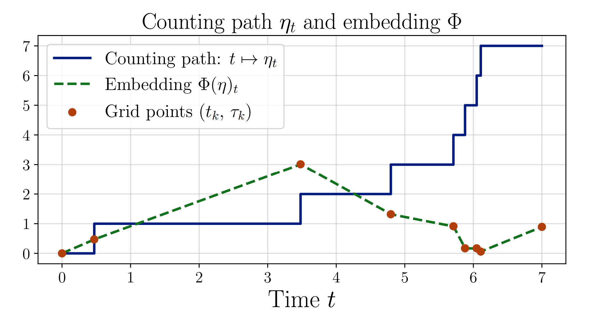
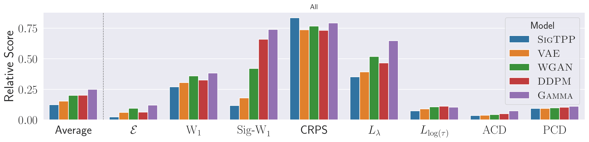
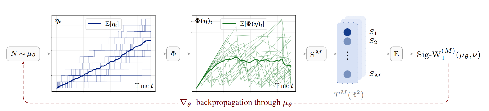

<div align="center">

# From Jumps to Signatures

### A Generative Method for Temporal Point Processes

<p>
  
  
  <a href="LICENSE"></a>
  <a href="https://arxiv.org/abs/2607.06652"></a>
</p>



<em>The interarrival embedding Φ lifts a càdlàg counting staircase into a continuous path that signatures can read.</em>

</div>

This is the research code for the manuscript *From Jumps to Signatures: A Generative Method for Temporal Point
Processes*
(Cariou-Kotlarek & Lampos, 2026). The focus is **unconditional** sequence generation, comparing SigTPP against WGAN,
DDPM (score-based), VAE, and other baselines.

> **TL;DR:** We introduce a stable embedding that brings rough-path signatures to temporal point processes and use it
> to build **SigTPP**, a generative model trained with a global trajectory-level loss. We also derive three principled
> discrepancies for evaluating counting-path distributions. Across synthetic and real-world datasets, SigTPP achieves
> the best overall average rank across eight complementary metrics.

## 📊 Key results

<table>
  <tr><td>🏆 Best average rank</td><td>across <strong>8</strong> complementary metrics</td></tr>
  <tr><td>✅ Beats or ties the strongest baseline</td><td>on <strong>64%</strong> of dataset–metric pairs</td></tr>
  <tr><td>📈 Average improvement over <em>every</em> baseline</td><td>at least <strong>19%</strong></td></tr>
  <tr><td>🗃️ Datasets</td><td><strong>9</strong> (4 synthetic · 5 real-world)</td></tr>
</table>

On the synthetic suite, SigTPP improves pairwise over WGAN by **52%**, VAE by **34%**, and DDPM by **48%** (averaged
over
datasets and metrics). Gains are largest on pathwise distributional criteria; diffusion and variational baselines stay
competitive on marginal calibration.

<div align="center">


<em>Relative scores vs. the deterministic baseline across all datasets; lower is better.</em>
</div>

## 🔄 How it works

SigTPP samples a counting path, embeds it with Φ into a continuous curve, maps it to its truncated signature, and
matches
the **expected** signature of the generated paths against that of the data. The target signature is precomputed once, so
each gradient step only signs the model's own samples.

<div align="center">


<em>sample → Φ → truncated signature → expected signature → Sig-W₁ loss → backprop through the generator.</em>
</div>

## ⚙️ Installation

The canonical paper-reproduction environment is **Python 3.8**, `torch==1.12.1+cu116` (CUDA 11.6), and
`signatory==1.2.6.1.9.0`.

Create and activate a **Python 3.8** environment, using **either** conda **or** venv:

```bash
# Option A: conda (provides Python 3.8 and a working pip)
conda create -n tpp_gan python=3.8 && conda activate tpp_gan

# Option B: venv (Python 3.8 must already be installed)
python -m venv .venv && source .venv/bin/activate
```

Then install **in this exact order** (order matters: signatory compiles against the torch already present):

```bash
pip install --upgrade pip wheel
pip install torch==1.12.1+cu116 --extra-index-url https://download.pytorch.org/whl/cu116
pip install --no-build-isolation --no-binary signatory --no-cache-dir signatory==1.2.6.1.9.0
pip install -r requirements.txt
```

If your CUDA toolkit predates 11.6, `torch==1.9.0+cu102` also works and simplifies the `signatory` install, the prebuilt
wheel targets torch 1.9, so the source-build flags (`--no-build-isolation --no-binary --no-cache-dir`) are not required.

## 🗃️ Datasets

The paper experiments use **9 datasets**: 4 synthetic and 5 real-world. See [DATASETS.md](DATASETS.md).

## 🚀 Running experiments

Run from the repository root. Experiments are addressed by dataset name plus shared model config, for example
`poisson_three_marks/ddpm_test.yaml`:

```bash
python test/paper_experiments/train_model.py poisson_three_marks/ddpm_test.yaml
```

See [test/paper_experiments/README.md](test/paper_experiments/README.md) for config resolution details, all
registered experiments, and troubleshooting.

## 📁 Outputs

With the default configs, outputs are written under `test/paper_experiments/out/<dataset>/`:

```text
test/paper_experiments/out/<dataset>/
|- test_targets.pth              # shared test-set targets for this dataset
|- results_on_val_txt/
|  `- <model>_val_tuning_<ts>.txt     # per-config val scores from the grid search
|- results_on_test_txt/
|  `- <model>_final_test[_B<b>]_<model_name>_<ts>.txt  # test metrics for the winning config
|- results_on_test_npz/
|  `- <model>_final_test[_B<b>]_<model_name>_<ts>.npz  # per-bootstrap-replicate vectors (when n_bootstraps > 1)
|- results_on_ablation/
|  |- <model>_sig_degree_ablation_B<b>_<ts>.txt  # per-degree raw mean/std-column report
|  `- <model>_sig_degree_ablation_B<b>_<ts>.npz  # per-degree per-replicate vectors
|- results_on_multiseed/          # only when `seeds` has more than one entry
|  |- <model>_multiseed_per_seed_<ts>.txt  # all seeds' val tables, concatenated (each seed's own
|  |                                       #   val_tuning txt/sig_degree ablation files are NOT written; this
|  |                                       #   aggregate is built from in-memory rows instead)
|  |- <model>_multiseed_summary_<ts>.txt   # per-config mean/std across seeds, picks the global winner
|  |- <model>_multiseed_test_by_seed_<ts>.txt  # the SAME globally-selected config, tested once per seed
|  |- <model>_multiseed_test_summary_<ts>.txt  # that config's test mean/std/n_valid across seeds
|  `- <model>_final_test[_B<b>]_<model_name>_<ts>.npz  # per-seed bootstrap replicates from the winner's test pass (when n_bootstraps > 1); no matching .txt
`- models/
   `- <model_name>/
      |- model-*.ckpt
      |- loss_history.svg
      |- *_test.png
      `- samples_gen.pth
```

Aggregated results across all datasets are written to:

```text
test/paper_experiments/out/
|- results_raw.txt        # one row per completed run (input to bootstrap recomputation)
`- results_bootstrap.txt  # bootstrapped summary produced by recompute_bootstrap.py
```

## 🧪 Running tests

```bash
# Linux/macOS
PYTHONPATH=src:. python -m pytest tests_src/ -v

# Windows PowerShell
$env:PYTHONPATH="src;."
python -m pytest tests_src/ -v
```

GitHub Actions runs the test suite on Python 3.8 and CPU-only `torch==1.12.1+cpu`. Tests guarded by
`pytest.importorskip("signatory")` skip automatically there.

## 🗂️ Project structure

```text
.                               # Repository root (name it whatever you like)
|- assets/readme/               # Figures displayed in this README
|- DATASETS.md                  # Dataset scope, access, preprocessing, and mark conventions
|- src/                         # Core library: architectures, metrics, plots, utils
|- test/paper_experiments/      # Main experiment runner, configs, dataset modules
|- tests_src/                   # Unit and integration tests
|- config.py
`- requirements.txt
```

## 🛠️ Implemented methods

| Key      | Model                            | Source                                                                              |
|----------|----------------------------------|-------------------------------------------------------------------------------------|
| `sigtpp` | Signature Wasserstein GAN (ours) | [architecture_one_to_one.py](src/nn/architectures/architecture_one_to_one.py)       |
| `wgan`   | Wasserstein GAN baseline         | [architecture_wgan_baseline.py](src/nn/architectures/architecture_wgan_baseline.py) |
| `ddpm`   | Score-based (DDPM) model         | [architecture_ddpm.py](src/nn/architectures/architecture_ddpm.py)                   |
| `vae`    | Variational autoencoder          | [architecture_vae.py](src/nn/architectures/architecture_vae.py)                     |
| `deter`  | Deterministic RNN baseline       | [architecture_deter.py](src/nn/architectures/architecture_deter.py)                 |
| `gamma`  | Parametric gamma baseline        | [architecture_gamma.py](src/nn/architectures/architecture_gamma.py)                 |

## 📝 Citation

If you use this code in research, please cite the associated manuscript:

```bibtex
@unpublished{cariou-kotlarek2026jumps,
  title = {From Jumps to Signatures: A Generative Method for Temporal Point Processes},
  author = {Cariou-Kotlarek, Niels and Lampos, Vasileios},
  note = {arXiv:2607.06652},
  eprint = {2607.06652},
  archivePrefix = {arXiv},
  year = {2026}
}
```

Machine-readable citation metadata is provided in [CITATION.cff](CITATION.cff);
venue and DOI details will be finalised on publication.

## ⚖️ License

Released under the MIT License. See [LICENSE](LICENSE).
